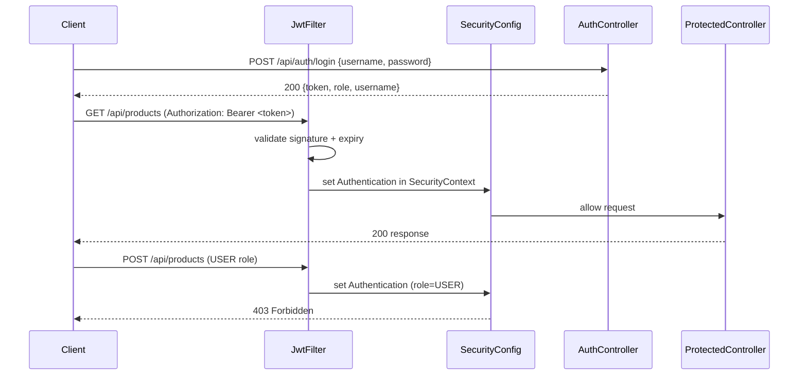
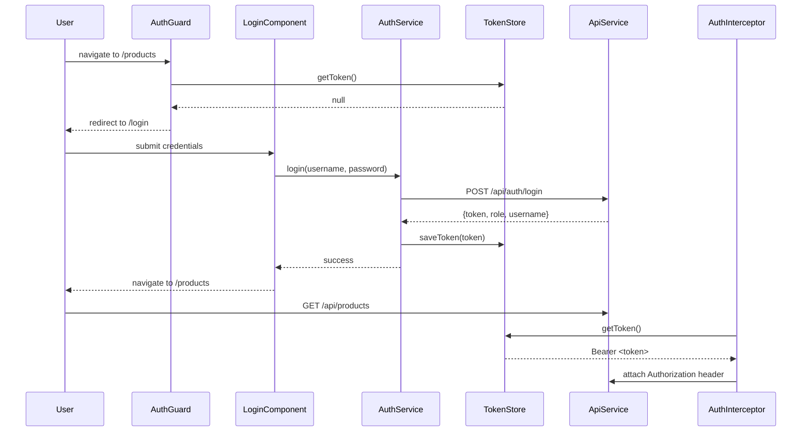
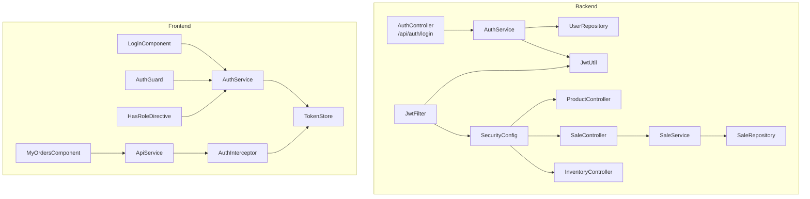

# Design Document: Role-Based Access Control

## Overview

This feature adds authentication and role-based authorization to the Shop Inventory Management System. The system currently has no security layer — every API endpoint and UI action is open to anyone. This design introduces two roles (ADMIN and USER), a JWT-based login mechanism, and enforces permissions end-to-end across the Spring Boot backend and Angular frontend.

**ADMIN** users have full access: product management (create, edit, toggle-active), inventory management (stock purchase), sales creation, and a view of all sales. **USER** users can browse products, complete sales (checkout), and view their own order history.

### Key Design Decisions

1. **JWT over sessions**: Stateless JWT tokens fit the existing REST architecture and avoid server-side session storage. The 8-hour expiry balances security with usability for a shop workday.
2. **jjwt library**: The `io.jsonwebtoken:jjwt-*` suite (0.12.x) is the standard Spring Boot JWT library — well-maintained, type-safe API, and integrates cleanly with Spring Security's filter chain.
3. **BCrypt password hashing**: Spring Security's `BCryptPasswordEncoder` is the industry standard for password storage. It is built into `spring-boot-starter-security` with no extra dependencies.
4. **`Sale.userId` association**: Rather than a full `User` foreign key relationship, storing `userId` as a plain `Long` column on `Sale` keeps the change minimal and avoids cascading JPA complexity. The `User` entity lives in its own `auth` package.
5. **Angular structural directive for role visibility**: A `*appHasRole` directive mirrors the pattern of `*ngIf` and keeps role-gating declarative in templates, consistent with Angular idioms.
6. **`TokenStore` as a thin wrapper**: Isolating `localStorage` access in a dedicated service makes the token lifecycle testable and swappable (e.g., to `sessionStorage`) without touching consumers.

---

## Architecture

### Backend Security Flow



### Frontend Auth Flow



### Component Interaction Diagram



---

## Components and Interfaces

### Backend Components

#### `com.example.shop.auth` package (new)

**`User` entity**
- JPA entity with `id`, `username`, `passwordHash`, `role` (enum: `ADMIN`, `USER`)
- `@Table(name = "users")` with unique constraint on `username`

**`Role` enum**
- `ADMIN`, `USER`

**`UserRepository`**
- `Optional<User> findByUsername(String username)`

**`AuthController`** — `POST /api/auth/login`
- Accepts `LoginRequest { username, password }`
- Returns `AuthResponse { token, username, role }`
- Delegates to `AuthService`

**`AuthService`**
- `AuthResponse login(LoginRequest)` — loads user, verifies BCrypt password, issues JWT
- Implements `UserDetailsService` for Spring Security integration

**`JwtUtil`**
- `String generateToken(User user)` — creates signed JWT with `sub` (username), `userId`, `role` claims, 8-hour expiry
- `Claims parseToken(String token)` — validates signature and expiry, returns claims
- `String extractUsername(String token)`
- `Long extractUserId(String token)`
- `String extractRole(String token)`

**`JwtFilter`** extends `OncePerRequestFilter`
- Reads `Authorization: Bearer <token>` header
- Calls `JwtUtil.parseToken()`, sets `UsernamePasswordAuthenticationToken` in `SecurityContextHolder`
- Passes through on missing/invalid token (Spring Security handles 401 downstream)

**`SecurityConfig`** — `@Configuration @EnableWebSecurity`
- Disables CSRF (stateless REST API)
- Configures `SessionCreationPolicy.STATELESS`
- Registers `JwtFilter` before `UsernamePasswordAuthenticationFilter`
- Defines `SecurityFilterChain` with path-level rules (see Authorization Matrix below)
- Exposes `BCryptPasswordEncoder` and `AuthenticationManager` beans

**`DataInitializer`** (extended)
- Seeds `admin` / `user` accounts on startup if they don't exist

#### Authorization Matrix

| Endpoint | Method | Required Role |
|---|---|---|
| `/api/auth/login` | POST | Public |
| `/api/products` | GET | ADMIN or USER |
| `/api/products/{id}` | GET | ADMIN or USER |
| `/api/products` | POST | ADMIN |
| `/api/products/{id}` | PUT | ADMIN |
| `/api/products/{id}/toggle-active` | POST | ADMIN |
| `/api/stock/purchase` | POST | ADMIN |
| `/api/sales` | POST | ADMIN or USER |
| `/api/sales` | GET | ADMIN |
| `/api/sales/{id}` | GET | ADMIN or USER (ownership check in service) |
| `/api/sales/my-orders` | GET | ADMIN or USER |
| `/h2-console/**` | ALL | Public (dev only) |

#### `SaleController` / `SaleService` changes

- `POST /api/sales` — extracts `userId` from `SecurityContext`, passes to `SaleService.createSale(request, userId)`
- `GET /api/sales/{id}` — service checks `sale.userId == currentUserId` for USER role; ADMIN bypasses
- `GET /api/sales/my-orders` — new endpoint; USER gets own sales, ADMIN gets all
- `GET /api/sales` — new endpoint; ADMIN only, returns all sales

### Frontend Components

#### `core/services/auth.service.ts`
- `login(username, password): Observable<AuthResponse>` — calls `POST /api/auth/login`, stores token
- `logout(): void` — clears token, navigates to `/login`
- `getCurrentUser(): CurrentUser | null` — decodes JWT payload from `TokenStore`
- `isAuthenticated(): boolean`
- `hasRole(role: string): boolean`
- `currentUser$: BehaviorSubject<CurrentUser | null>` — reactive user state for components

#### `core/services/token-store.service.ts`
- `saveToken(token: string): void` — writes to `localStorage`
- `getToken(): string | null` — reads from `localStorage`
- `clearToken(): void` — removes from `localStorage`
- `private readonly STORAGE_KEY = 'shop_auth_token'`

#### `core/interceptors/auth.interceptor.ts`
- Functional interceptor (`HttpInterceptorFn`)
- Reads token from `TokenStore`, clones request with `Authorization: Bearer <token>` header
- On HTTP 401: clears token, redirects to `/login`
- On HTTP 403: shows snackbar "You do not have permission to perform this action"

#### `core/guards/auth.guard.ts`
- Functional guard (`CanActivateFn`)
- Checks `AuthService.isAuthenticated()` — redirects to `/login` if false
- Optionally checks required role from route `data.roles` array

#### `shared/directives/has-role.directive.ts`
- Structural directive `*appHasRole="'ADMIN'"`
- Injects `AuthService`, subscribes to `currentUser$`
- Calls `ViewContainerRef.createEmbeddedView()` or `ViewContainerRef.clear()` based on role match

#### `auth/login/login.component.ts` (new feature module)
- Standalone component at route `/login`
- Reactive form: `username` (required), `password` (required)
- On submit: calls `AuthService.login()`, navigates to `/products` on success
- Displays error message on 401 response
- Redirects to `/products` if already authenticated

#### `sales/pages/my-orders/my-orders.component.ts` (new)
- Calls `GET /api/sales/my-orders` on init
- Displays table: Sale ID, Date, Total Amount, Item Count
- Empty state message when no orders
- Error state message on API failure

#### `app.component.ts` changes
- Adds "My Orders" nav link (visible to USER role via `*appHasRole`)
- Adds "Logout" button
- Hides "My Orders" for ADMIN role

---

## Data Models

### Backend

#### `User` entity

```java
@Entity
@Table(name = "users", uniqueConstraints = @UniqueConstraint(columnNames = "username"))
public class User {
    @Id @GeneratedValue(strategy = GenerationType.IDENTITY)
    private Long id;

    @Column(nullable = false, unique = true, length = 50)
    private String username;

    @Column(nullable = false)
    private String passwordHash;

    @Enumerated(EnumType.STRING)
    @Column(nullable = false, length = 10)
    private Role role;
}
```

#### `Role` enum

```java
public enum Role {
    ADMIN, USER
}
```

#### `Sale` entity (modified)

```java
// Added field:
@Column(name = "user_id")
private Long userId;
```

The `userId` column is nullable to preserve backward compatibility with existing sale records that were created before authentication was introduced.

#### JWT Payload Claims

```json
{
  "sub": "admin",
  "userId": 1,
  "role": "ADMIN",
  "iat": 1700000000,
  "exp": 1700028800
}
```

### Frontend

#### `AuthResponse` interface

```typescript
interface AuthResponse {
  token: string;
  username: string;
  role: 'ADMIN' | 'USER';
}
```

#### `CurrentUser` interface

```typescript
interface CurrentUser {
  userId: number;
  username: string;
  role: 'ADMIN' | 'USER';
}
```

#### `LoginRequest` interface

```typescript
interface LoginRequest {
  username: string;
  password: string;
}
```

### Updated API Service additions

```typescript
// Added to ApiService:
getMyOrders(): Observable<SaleResponse[]>
getAllSales(): Observable<SaleResponse[]>
```

### Updated `SaleResponse` (backend DTO)

```java
// SaleResponse gains:
private Long userId;  // included for ADMIN views
```

### Database Schema Changes

```sql
-- New table
CREATE TABLE users (
    id BIGINT PRIMARY KEY AUTO_INCREMENT,
    username VARCHAR(50) NOT NULL UNIQUE,
    password_hash VARCHAR(255) NOT NULL,
    role VARCHAR(10) NOT NULL
);

-- Modified table
ALTER TABLE sales ADD COLUMN user_id BIGINT;
```

---

## Correctness Properties

*A property is a characteristic or behavior that should hold true across all valid executions of a system — essentially, a formal statement about what the system should do. Properties serve as the bridge between human-readable specifications and machine-verifiable correctness guarantees.*

### Property 1: JWT round-trip preserves identity claims

*For any* valid `User` (with any username, userId, and role), generating a JWT and then parsing it SHALL produce the same username, userId, and role that were encoded.

**Validates: Requirements 1.2, 1.4**

---

### Property 2: Invalid credentials never produce a token

*For any* login request where the password does not match the stored BCrypt hash for the given username, the `AuthService` SHALL return an error and SHALL NOT return a JWT.

**Validates: Requirements 1.3**

---

### Property 3: BCrypt password hashing is non-reversible and verifiable

*For any* plaintext password, encoding it with `BCryptPasswordEncoder` SHALL produce a hash that (a) does not equal the plaintext, and (b) passes `BCryptPasswordEncoder.matches(plaintext, hash)`.

**Validates: Requirements 1.1, 4.4**

---

### Property 4: Sale ownership is preserved end-to-end

*For any* authenticated USER who creates a sale, the persisted `Sale` entity SHALL have a `userId` equal to that user's ID, and `GET /api/sales/my-orders` SHALL include that sale in its response.

**Validates: Requirements 2.7, 3.2**

---

### Property 5: My-orders returns only the requesting user's sales

*For any* USER with a set of sales, calling `GET /api/sales/my-orders` SHALL return exactly the sales whose `userId` matches the authenticated user's ID — no more, no less.

**Validates: Requirements 3.2**

---

### Property 6: Role directive correctly gates visibility

*For any* `CurrentUser` with a given role and any element annotated with `*appHasRole="'ADMIN'"`, the element SHALL be present in the DOM if and only if the user's role is `ADMIN`.

**Validates: Requirements 6.1, 6.2, 6.3**

---

### Property 7: Auth interceptor attaches token to every request

*For any* outgoing HTTP request when a valid token is present in `TokenStore`, the cloned request produced by `AuthInterceptor` SHALL contain an `Authorization` header with value `Bearer <token>`.

**Validates: Requirements 6.6**

---

## Error Handling

### Backend

| Scenario | HTTP Status | Response Body |
|---|---|---|
| Invalid credentials | 401 | `{ "message": "Invalid username or password" }` |
| Missing/expired JWT | 401 | `{ "message": "Authentication required" }` |
| Valid JWT, insufficient role | 403 | `{ "message": "Access denied" }` |
| USER accessing another user's sale | 403 | `{ "message": "Access denied" }` |
| Duplicate username on seed | — | Silently skipped (idempotent seed) |

Spring Security's `AuthenticationEntryPoint` handles 401 responses for missing/invalid tokens. `AccessDeniedHandler` handles 403 responses. Both are configured in `SecurityConfig` to return JSON (matching the existing `ErrorResponse` format) rather than the default HTML error pages.

The existing `GlobalExceptionHandler` is extended to handle `AccessDeniedException` and `AuthenticationException` with the same `ErrorResponse` structure used throughout the app.

### Frontend

| Scenario | Behavior |
|---|---|
| 401 from any API call | `AuthInterceptor` clears token, redirects to `/login` |
| 403 from any API call | `AuthInterceptor` shows snackbar: "You do not have permission to perform this action" |
| Login form — 401 | `LoginComponent` shows inline error: "Invalid username or password" |
| My Orders — API failure | `MyOrdersComponent` shows error message in place of table |
| Token missing on protected route | `AuthGuard` redirects to `/login` before any API call is made |

The existing `errorInterceptor` handles general errors. The new `authInterceptor` is registered first in the interceptor chain (in `app.config.ts`) so it can intercept 401/403 before the generic error handler fires, preventing duplicate snackbar messages for auth errors.

---

## Testing Strategy

### Unit Tests (Backend)

- **`JwtUtilTest`**: Verify token generation and parsing round-trips for both roles; verify expired tokens are rejected; verify tampered tokens (wrong signature) are rejected.
- **`AuthServiceTest`**: Verify correct credentials return `AuthResponse`; verify wrong password throws `BadCredentialsException`; verify unknown username throws `BadCredentialsException`.
- **`SaleServiceTest`** (extended): Verify `createSale` stores `userId` from the security context; verify `getSalesByUser` filters by `userId`; verify ADMIN `getSalesByUser` returns all sales.
- **`SecurityConfigTest`**: Verify public endpoints (`/api/auth/login`) are accessible without a token; verify ADMIN-only endpoints return 403 for USER tokens; verify protected endpoints return 401 without a token.

### Property-Based Tests (Backend)

Use **jqwik** (Java property-based testing library) for the following properties:

- **Property 1** — `JwtUtilTest`: Generate arbitrary `User` instances (random usernames, IDs, roles); assert `parseToken(generateToken(user))` returns matching claims. Run 200 iterations.
  - Tag: `Feature: role-based-access-control, Property 1: JWT round-trip preserves identity claims`

- **Property 2** — `AuthServiceTest`: Generate arbitrary username/password pairs where the password does not match the stored hash; assert `login()` always throws and never returns a token. Run 200 iterations.
  - Tag: `Feature: role-based-access-control, Property 2: Invalid credentials never produce a token`

- **Property 3** — `PasswordEncoderTest`: Generate arbitrary plaintext strings; assert encoded value differs from plaintext and `matches()` returns true. Run 200 iterations.
  - Tag: `Feature: role-based-access-control, Property 3: BCrypt password hashing is non-reversible and verifiable`

- **Property 4 & 5** — `SaleServiceTest`: Generate arbitrary lists of sales with random `userId` values; assert `getSalesByUser(userId)` returns exactly the subset matching that `userId`. Run 200 iterations.
  - Tag: `Feature: role-based-access-control, Property 4 & 5: Sale ownership and my-orders filtering`

### Unit Tests (Frontend)

- **`AuthService`**: Verify `login()` stores token and emits `currentUser$`; verify `logout()` clears token and emits null; verify `hasRole()` returns correct boolean for each role.
- **`TokenStore`**: Verify `saveToken` / `getToken` / `clearToken` round-trip via `localStorage`.
- **`AuthInterceptor`**: Verify `Authorization` header is attached when token is present; verify redirect on 401; verify snackbar on 403.
- **`AuthGuard`**: Verify unauthenticated users are redirected to `/login`; verify authenticated users pass through.
- **`HasRoleDirective`**: Verify element is rendered for matching role; verify element is removed for non-matching role.

### Property-Based Tests (Frontend)

Use **fast-check** for the following properties:

- **Property 6** — `HasRoleDirective` spec: Generate arbitrary role strings; assert directive shows element if and only if the role matches the required role.
  - Tag: `Feature: role-based-access-control, Property 6: Role directive correctly gates visibility`

- **Property 7** — `AuthInterceptor` spec: Generate arbitrary HTTP requests and token strings; assert every cloned request has `Authorization: Bearer <token>` when token is non-null.
  - Tag: `Feature: role-based-access-control, Property 7: Auth interceptor attaches token to every request`

### Integration Tests

- **`AuthControllerIT`**: Full Spring Boot test — POST `/api/auth/login` with seeded credentials returns 200 + valid JWT; wrong password returns 401.
- **`SecurityIT`**: Full Spring Boot test — verify each endpoint in the authorization matrix returns the correct status for ADMIN token, USER token, and no token.
- **`SaleControllerIT`**: Verify `POST /api/sales` associates `userId`; verify `GET /api/sales/my-orders` returns correct subset; verify USER cannot access another user's sale via `GET /api/sales/{id}`.

### Smoke Tests

- Verify seeded `admin` and `user` accounts exist on startup with correct roles.
- Verify H2 console remains accessible in development mode after security is applied.
